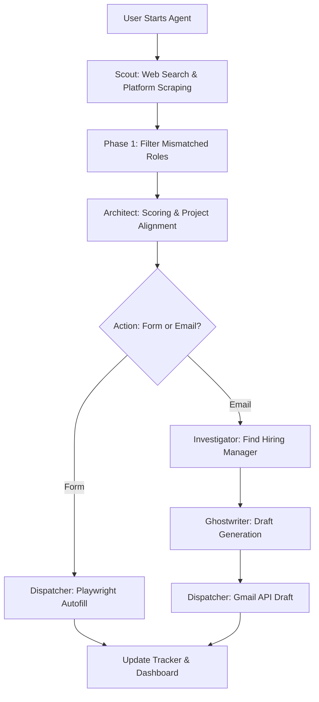

<div align="center">
  
# Career-Orbit 🚀
### *Autonomous Multi-Agent Job Discovery & Application Platform*

[](https://nextjs.org/)
[](https://www.python.org/)
[](https://groq.com/)
[](https://playwright.dev/)
[](LICENSE)
[](http://makeapullrequest.com)

**Career-Orbit** is an advanced open-source intelligence platform designed to democratize the job search process. By providing candidates with their own autonomous "Agentic Team," Career-Orbit automates lead discovery, technical alignment review, and personalized outreach.

</div>

---

## 🌟 Key Features

* **Multi-Agent Orchestration:** Powered by a suite of specialized LLM agents (Scout, Architect, Ghostwriter, Dispatcher) working in tandem.
* **Next.js Command Center:** A real-time telemetry dashboard to monitor agent progress, conversion funnels, and manage processes safely.
* **Automated ATS Form Filling:** Uses Playwright alongside an LLM to smartly map your profile to complex job application forms.
* **Hyper-Personalized Cold Emails:** Evaluates Job Descriptions against your CV to draft highly specific, non-hallucinated outreach emails directly to your Gmail drafts.
* **100% Local Execution:** Runs locally to maintain privacy and bypass serverless timeouts for heavy browser automation tasks.

---

## 🏛️ In-Depth Technical Architecture

Career-Orbit utilizes a pipeline designed to handle high-concurrency tasks while maintaining strict data integrity and rate-limiting compliance.

### 🧠 The Core Agent Intelligence

| Agent | Responsibility | In-Depth Logic |
| :--- | :--- | :--- |
| **🔍 Scout** | **Market Intelligence** | Executes multi-platform searches. Uses LLM semantic filtering to discard mismatched seniority levels. |
| **🏗️ Architect** | **Technical Alignment** | Performs **Project-to-JD Matching**. Scores roles (0-10) based on tech stack, research, and proof-of-work. |
| **✍️ Ghostwriter** | **Strategic Outreach** | Crafts personalized emails using a professional tone. Enforces strict length limits and prevents hallucination. |
| **🤖 Dispatcher** | **Execution & Automation**| Handles Playwright browser injection for applications and Gmail API integration for drafting emails. |

### 🛠️ Data Flow



---

## 🚀 Installation & Setup

### 1. Prerequisites
- **Python 3.10+** (Virtual environment highly recommended)
- **Node.js 18+** (For the Dashboard)
- **Groq API Key** (For ultra-fast LLM inference)
- **Google OAuth2 Credentials** (`credentials.json` for Gmail API)

### 2. Local Setup
```bash
# Clone the repository
git clone https://github.com/Karanpr-18/Career-Orbit.git
cd Career-Orbit

# Setup Python Backend
python -m venv venv
source venv/bin/activate  # Or `venv\Scripts\activate` on Windows
pip install -r requirements.txt
playwright install chromium

# Setup Next.js Dashboard
npm install
npm run dev
```

### 3. Environment Configuration
Create a `.env` file in the root directory:
```env
GROQ_API_KEY=your_groq_key
SERPER_API_KEY=your_serper_key
EMAILABLE_API_KEY=your_emailable_key
RESUME_PATH=/path/to/my_resume.pdf
MAX_APPLICATIONS_PER_DAY=50
```

---

## 🗺️ Roadmap & Future Improvements (Call for Contributors!)

We are actively working to make Career-Orbit **100% free and independent** of commercial API limits. We welcome Pull Requests for the following planned improvements:

- [ ] **Migrate to SQLite:** Replace `tracker.csv` with a local SQLite database to prevent I/O locking between the Next.js frontend and Python backend.
- [ ] **100% Free Search:** Replace the paid `Serper.dev` API with the free `duckduckgo-search` Python package.
- [ ] **Local Email Verification:** Replace the `Emailable` API by implementing local MX record resolution and SMTP pinging.
- [ ] **Markdown Resumes:** Transition from `pypdf` extraction to Markdown (`.md`) based CVs to drastically improve LLM context ingestion and formatting.
- [ ] **Stealth Browser Automation:** Integrate `playwright-stealth` or `undetected-chromedriver` to bypass aggressive ATS bot protections (Cloudflare/DataDome).
- [ ] **Asynchronous Processing:** Implement `asyncio` for the Architect phase to evaluate multiple job descriptions concurrently.
- [ ] **Draft Management UI:** Add a feature to the Next.js dashboard to fetch, review, and send Gmail drafts directly from the Command Center.

---

## 🤝 Contributing

Career-Orbit is an open-source model for the world. We encourage developers to expand its capabilities! 

1. Fork the Project
2. Create your Feature Branch (`git checkout -b feature/AmazingFeature`)
3. Commit your Changes (`git commit -m 'Add some AmazingFeature'`)
4. Push to the Branch (`git push origin feature/AmazingFeature`)
5. Open a Pull Request

---

## 📄 License

Distributed under the MIT License. See `LICENSE` for more information.

<div align="center">
  <i>Leveling the global job market through open-source intelligence.</i>
</div>