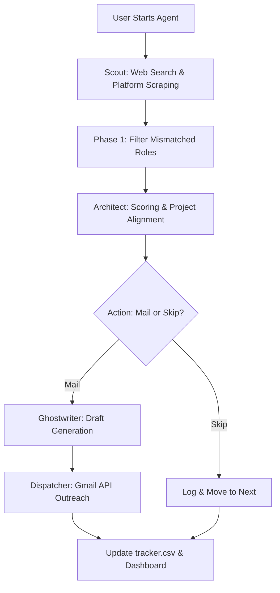

# Career-Orbit 🚀
### *Empowering the World through Autonomous AI Job Discovery*

[](https://nextjs.org/)
[](https://www.python.org/)
[](https://groq.com/)
[](LICENSE)
[](https://github.com/Karanpr-18/Career-Orbit)

**Career-Orbit** is an advanced open-source intelligence platform designed to democratize the job search process. By providing candidates with their own autonomous "Agentic Team," Career-Orbit automates lead discovery, technical alignment review, and personalized outreach.

---

## 🏛️ In-Depth Technical Architecture

Career-Orbit utilizes a **Distributed Multi-Agent Pipeline** built on the AgentScope framework. The system is designed to handle high-concurrency tasks while maintaining strict data integrity and rate-limiting compliance.

### 🧠 The Core Agent Intelligence

| Agent | Responsibility | In-Depth Logic |
| :--- | :--- | :--- |
| **🔍 Scout** | **Market Intelligence** | Executes multi-platform recursive searches. Uses LLM-based semantic filtering to discard senior/staff roles. |
| **🏗️ Architect** | **Technical Alignment** | Performs **Project-to-JD Matching**. Scores roles (0-10) based on tech stack, research publications, and proof-of-work. |
| **✍️ Ghostwriter** | **Strategic Outreach** | Crafts personalized emails using a "Gen-Z Professional" tone. Enforces a **100-word limit** and professional formatting. |
| **🤖 Assistant** | **System Interaction** | Provides a RAG-ready interface to query application history and system logs directly from the dashboard. |

### 🛠️ Data Flow & Pipeline Stages



---

## 🖥️ The Command Center (Next.js 15)

The dashboard is not just a UI; it's a real-time orchestrator for the backend agents.

- **Real-Time Telemetry**: Uses a streaming log system to pipe Python `logger` output directly to a virtualized terminal window.
- **Process Management**: Features a robust `SIGKILL`-based stop system and a PID-check startup routine to prevent zombie processes.
- **Dynamic Stats**: An interactive grid that provides a live breakdown of your conversion funnel (Leads -> Mailed -> Interviews).
- **Responsive Design**: A premium, glassmorphism-based design system that scales from desktop monitors to mobile devices.

---

## ⚙️ Advanced Configuration & Customization

### 1. Broadening the Funnel (`config.py`)
Customize your search engine to target specific industries or niches:
- **`TARGET_SITES`**: Currently supports 15+ major platforms including Wellfound, Instahyre, and LinkedIn.
- **`SEARCH_QUERIES`**: Highly customizable list of search variations (e.g., "GenAI Intern India", "Junior ML Engineer").

### 2. Scoring Logic (`Architect`)
The Architect evaluates jobs based on:
- **Tech Stack Match**: Does the JD mention your core languages (Python, JS, etc.)?
- **Proof of Work**: Does the JD align with your projects (Humana, TalentAI, etc.)?
- **Research Alignment**: Mentioning publications if the role is research-heavy.

---

## ⚡ Deployment & Setup

### 1. Prerequisites
- **Python 3.10+** (Virtual environment highly recommended)
- **Node.js 18+** (For the Dashboard)
- **Groq API Key** (For inference speeds up to 500 tokens/sec)
- **Google OAuth2** (`credentials.json` for Gmail)

### 2. Installation
```bash
# Clone and Setup Python
git clone https://github.com/Karanpr-18/Career-Orbit.git
cd Career-Orbit
python -m venv venv
source venv/bin/activate
pip install -r requirements.txt
playwright install chromium

# Setup Dashboard
npm install
npm run dev
```

### 3. Environment Variables (`.env`)
```env
GROQ_API_KEY=your_key
TRACKER_CSV_PATH=/path/to/tracker.csv
RESUME_PATH=/path/to/resume.pdf
CV_PATH=/path/to/cv.pdf
```

---

## 🤝 Contributing to the Movement

Career-Orbit is an open-source model for the world. We encourage developers to expand its capabilities:
- **New Scout Sites**: Add support for more region-specific job boards.
- **New Agent Personalities**: Help us refine the Ghostwriter's outreach strategies.
- **UI Enhancements**: Improve the dashboard's analytics and visualization tools.

---

*Career-Orbit — Leveling the global job market through open-source intelligence.*
